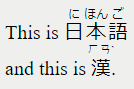
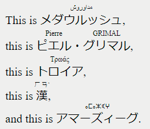

# Grav Markdown RubyText Plugin

The **markdown-rubytext plugin** for [Grav](http://github.com/getgrav/grav) allows you to add output <ruby> tagged text in Markdown:

# Installation

This plugin is easy to install with GPM.

```
$ bin/gpm install markdown-rubytext
```

# Configuration

Simply copy the `user/plugins/markdown-color/markdown-rubytext.yaml` into `user/config/plugins/markdown-rubytext.yaml` and make your modifications.

```
enabled: true
```

# Usage

## simple and serial ruby

In your markdown file, __thoses shortcodes__:

```
This is {r}日(に)本(ほん)語(ご){/r}
and this is {r}漢(ㄏㄢˋ){/r}.
```

Will produce the __following HTML__:

```
This is <ruby><rb>日</rb><rp>（</rp><rt>に</rt><rp>）</rp><rb>本</rb><rp>（</rp><rt>ほん</rt><rp>）</rp><rb>語</rb><rp>（</rp><rt>ご</rt><rp>）</rp></ruby> 
and this is <ruby><rb>漢</rb><rp>（</rp><rt>ㄏㄢˋ</rt><rp>）</rp></ruby>.
```

Standart display:



## new option (from v3.0.0): possiblity add a lang attributes

In your markdown file, it is now also possible to set __lang attributes__ like:

```
This is {r=ja/ar}メダウルッシュ(مداوروش){/r},
this is {r=ja/fr}ピエル(Pierre)・()グリマル(GRIMAL){/r},
this is {r=ja/grc}トロイア(Τρωάς){/r},
this is {r}漢(ㄏㄢˋ){/r},
and this is {r=ja/ber}アマーズィーグ(ⴰⵎⴰⵣⵉⵖ){/r}族.
```

Will produce the following HTML, nested by a __single `ruby` HTML tag__:

```
This is <ruby lang="ja"><rb>メダウルッシュ</rb><rp>(</rp><rt lang="ar">مداوروش</rt><rp>)</rp></ruby>, 
this is <ruby lang="ja"><rb>ピエル</rb><rp>(</rp><rt lang="fr">Pierre</rt><rp>)</rp><rb>・</rb><rp>(</rp><rt lang="fr"></rt><rp>)</rp><rb>グリマル</rb><rp>(</rp><rt lang="fr">GRIMAL</rt><rp>)</rp></ruby>,
this is <ruby lang="ja"><rb>トロイア</rb><rp>(</rp><rt lang="grc">Τρωάς</rt><rp>)</rp></ruby>,
this is <ruby><rb>漢</rb><rp>（</rp><rt>ㄏㄢˋ</rt><rp>）</rp></ruby>,
and this is <ruby lang="ja"><rb>アマーズィーグ</rb><rp>(</rp><rt lang="ber">ⴰⵎⴰⵣⵉⵖ</rt><rp>)</rp></ruby>.
```

Standart display:



__to be valid HTML, lang attributes has to be part of__:
1. [ISO 639-1 Language Codes List](https://www.w3schools.com/TAgs/ref_language_codes.asp),

OR

2. [ISO 639-2 Language Codes List](https://en.wikipedia.org/wiki/List_of_ISO_639-2_codes)

__Important note__:

To be valid, each lang attribute has to be of __2 *or* 3 letters maximum__.

# Future goal (difficult, please contribute)

## add possibility to enabled from page

In your `config` file:

```
enabled: true
active: false
```

In your markdown file:

```
markdown-rubytext:
    active: true
```

Would activate the plugin.

A example can be found with the `shortcode-core` plugin [here](https://github.com/getgrav/grav-plugin-shortcode-core).
